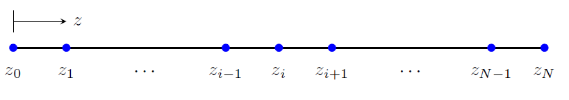
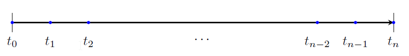

### Governing Equation

The partial differential equation governing one-dimensional consolidation is given by

$$
\frac{\partial u}{\partial t} - c_v \frac{\partial^2 u}{\partial z^2} = 0
$$

where $$ u $$ is the excess pore water pressure, $$ t $$ stands for time, $$ z $$ represents depth and $$ c_v $$ is the coefficient of consolidation which can be expressed as

$$
c_v = \frac{k}{m_v \gamma_w}
$$

with $$ k $$ being the coefficient of permeability, $$ m_v $$ the coefficient of volumetric compressibility and $$ \gamma_w $$ the unit weight of water.

### Spatial and Temporal Discretization

We will solve the consolidation problem over a 1D domain which is spatially discretized into $$ N $$ equally spaced units as shown in the figure below.

<!---
$$
\usetikzlibrary{arrows,calc,shapes,automata,positioning,decorations.markings}	
\begin{tikzpicture}
  \draw[thick] (0,0) -- (10,0);
  \draw[] (0,0.3) -- (0,0.7);
  \draw[->,-stealth] (0,0.5) -- (1,0.5);
  \node [right] at (1,0.5) {$$ z $$};
  \filldraw[blue] (0,0) circle (2pt);
  \filldraw[blue] (1,0) circle (2pt);
  \filldraw[blue] (4,0) circle (2pt);
  \filldraw[blue] (5,0) circle (2pt);
  \filldraw[blue] (6,0) circle (2pt);
  \filldraw[blue] (9,0) circle (2pt);
  \filldraw[blue] (10,0) circle (2pt);  
  \node [below] at (0,-0.25) {$$ z_0 $$};
  \node [below] at (1,-0.25) {$$ z_1 $$};
  \node [below] at (2.5,-0.25) {$$ \cdots $$};
  \node [below] at (4,-0.25) {$$ z_{i-1} $$};
  \node [below] at (5,-0.25) {$$ z_i $$};
  \node [below] at (6,-0.25) {$$ z_{i+1} $$};
  \node [below] at (7.5,-0.25) {$$ \cdots $$};
  \node [below] at (9,-0.25) {$$ z_{N-1} $$};
  \node [below] at (10,-0.25) {$$ z_N $$};
\end{tikzpicture}
$$
--->

The spatial discretization implies

$$
\Delta z = \frac{1}{N}, \qquad u_i = u(z_i), \qquad i=0,1,\cdots,N 
$$

for a 1D domain with a unit width. Note that if we have a domain with a depth $$ d $$, then $$ \Delta z = \frac{d}{N} $$. We also need temporal discretization as consolidation is a time dependent problem. A uniform time stepping from $$ t_0 $$ up to $$ t_n $$ is assumed and an illustration of this is shown below. For a selected time step $$ \Delta t $$, we have

$$
t_n = n\Delta t
$$

<!---
$$
\begin{tikzpicture}
  \draw[->,-stealth,thick] (0,0) -- (10,0);
  \draw[] (0,-0.25) -- (0,0.25);
  \draw[] (10,-0.25) -- (10,0.25);
  \filldraw[blue] (0,0) circle (1pt);
  \filldraw[blue] (1,0) circle (1pt);
  \filldraw[blue] (2,0) circle (1pt);
  \filldraw[blue] (8,0) circle (1pt);
  \filldraw[blue] (9,0) circle (1pt);
  \filldraw[blue] (10,0) circle (1pt);
  \node [below] at (0,-0.25) {$ t_0 $};
  \node [below] at (1,-0.25) {$ t_1 $};
  \node [below] at (2,-0.25) {$ t_2 $};
  \node [below] at (5,-0.25) {$ \cdots $};
  \node [below] at (8,-0.25) {$ t_{n-2} $};
  \node [below] at (9,-0.25) {$ t_{n-1} $};		
  \node [below] at (10,-0.25) {$ t_n $};		
\end{tikzpicture}
$$
--->

The partial derivatives in the governing PDE, in equation \eqref{eq:1D_consolidation}, can be approximated in various ways with respect to time and space. The most common approximations are discussed here.

### Explicit Method

In this method, the partial derivative of the excess pore pressure with respect to time is approximated using a forward difference equation. At time $$ t_n $$ and a spatial point $$ z_i $$, this approximation is given by

$$
\frac{\partial u}{\partial t} = \frac{u_i^{n+1} - u_i^n}{\Delta t}
$$

The spatial second derivative at $$ z_i $$, and at time level $$ t_n $$, is approximated by the symmetric difference equation

$$
\frac{\partial^2 u}{\partial z^2} = \frac{u_{i+1}^n - 2u_i^n + u_{i-1}^n}{\Delta z^2}
$$

Thus, the finite difference equation for one-dimensional consolidation becomes

$$
\frac{u_i^{n+1} - u_i^n}{\Delta t} - c_v \frac{u_{i+1}^n - 2u_i^n + u_{i-1}^n}{\Delta z^2} = 0
$$

Based on this equation, the pore pressure values at time $$ t_{n+1} $$ can be obtained from known values from time $$ t_n $$, together with specified initial and boundary conditions. Solving for $$ u_i^{n+1} $$ gives

$$
u_i^{n+1} = u_i^n + \kappa \left( u_{i+1}^n - 2u_i^n + u_{i-1}^n \right) 
$$

where 

$$
\kappa = c_v \frac{\Delta t}{\Delta z^2}
$$

An illustration of the explicit method is shown in Figure~\ref{fig:explicit_stencil}, which is a so-called *stencil*.

<!---
$$
\begin{tikzpicture}		
  \draw[] (0,0) -- (4,0);
  \draw[] (2,0) -- (2,2);
  \filldraw[blue] (0,0) circle (2pt);
  \filldraw[blue] (2,0) circle (2pt);
  \filldraw[blue] (4,0) circle (2pt);
  \filldraw[blue] (2,2) circle (2pt);		
  \node [below] at (0,-0.25) {$ i-1,n $};
  \node [below] at (2,-0.25) {$ i,n $};
  \node [below] at (4,-0.25) {$ i+1,n $};
  \node [above] at (2,2) {$ i,n+1 $};
  \draw[->,-stealth,thick] (1.75,-1) -- (2.25,-1);
  \node [right] at (2.25,-1) {$ z $};
  \draw[->,-stealth,thick] (-1,0.75) -- (-1,1.25);
  \node [above] at (-1,1.25) {$ t $};			
\end{tikzpicture}
$$
--->

The explicit method is known to be numerically stable and convergent for \(\kappa \leq 1/2\). This implies that for a given spatial
discretization, the time step must satisfy

$$
\Delta t \leq \frac{\Delta z^2}{2 c_v}
$$

for numerical stability and convergence. The error in the calculated pore pressure based on the explicit method is first-order accurate in time step and second-order accurate in space step, i.e. $$\mathcal{O}(\Delta t)$$ and $$\mathcal{O}(\Delta z^2)$$, respectively.
