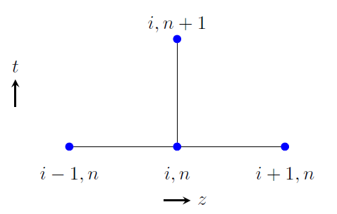
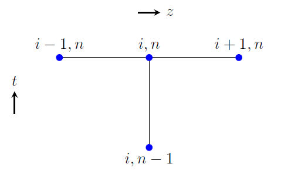
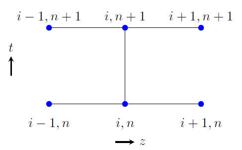
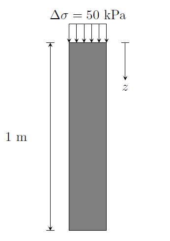
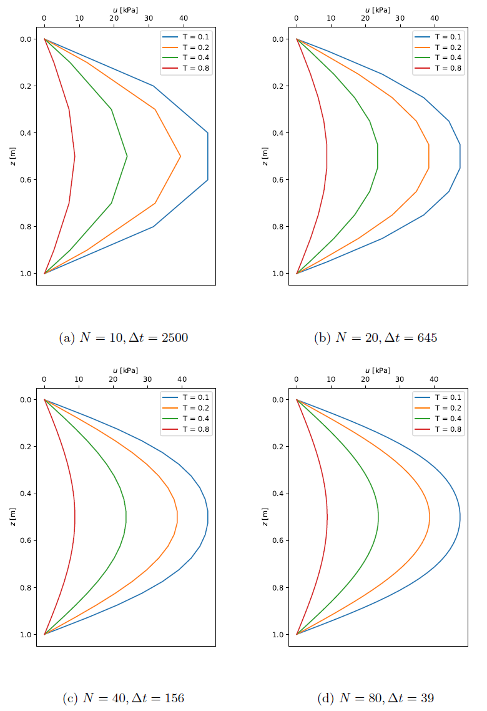
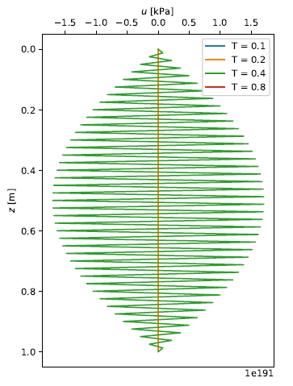
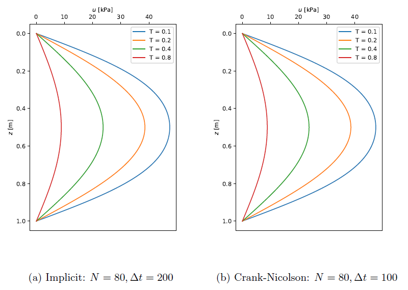

### **Governing Equation**

The partial differential equation governing one-dimensional consolidation is given by

$$
\frac{\partial u}{\partial t} - c_v \frac{\partial^2 u}{\partial z^2} = 0
$$

where $$ u $$ is the excess pore water pressure, $$ t $$ stands for time, $$ z $$ represents depth and $$ c_v $$ is the coefficient of consolidation which can be expressed as

$$
c_v = \frac{k}{m_v \gamma_w}
$$

with $$ k $$ being the coefficient of permeability, $$ m_v $$ the coefficient of volumetric compressibility and $$ \gamma_w $$ the unit weight of water.

### **Spatial and Temporal Discretization**

We will solve the consolidation problem over a 1D domain which is spatially discretized into $$ N $$ equally spaced units as shown in the figure below.

{: .center-image }
*Spatial discretization*

The spatial discretization implies

$$
\Delta z = \frac{1}{N}, \qquad u_i = u(z_i), \qquad i=0,1,\cdots,N 
$$

for a 1D domain with a unit width. Note that if we have a domain with a depth $$ d $$, then $$ \Delta z = \frac{d}{N} $$. We also need temporal discretization as consolidation is a time dependent problem. A uniform time stepping from $$ t_0 $$ up to $$ t_n $$ is assumed and an illustration of this is shown below. For a selected time step $$ \Delta t $$, we have

$$
t_n = n\Delta t
$$

{: .center-image }
*Temporal discretization*

The partial derivatives in the governing PDE can be approximated in various ways with respect to time and space. The most common approximations are discussed here.

### **Explicit Method**

In this method, the partial derivative of the excess pore pressure with respect to time is approximated using a forward difference equation. At time $$ t_n $$ and a spatial point $$ z_i $$, this approximation is given by

$$
\frac{\partial u}{\partial t} = \frac{u_i^{n+1} - u_i^n}{\Delta t}
$$

The spatial second derivative at $$ z_i $$, and at time level $$ t_n $$, is approximated by the symmetric difference equation

$$
\frac{\partial^2 u}{\partial z^2} = \frac{u_{i+1}^n - 2u_i^n + u_{i-1}^n}{\Delta z^2}
$$

Thus, the finite difference equation for one-dimensional consolidation becomes

$$
\frac{u_i^{n+1} - u_i^n}{\Delta t} - c_v \frac{u_{i+1}^n - 2u_i^n + u_{i-1}^n}{\Delta z^2} = 0
$$

Based on this equation, the pore pressure values at time $$ t_{n+1} $$ can be obtained from known values from time $$ t_n $$, together with specified initial and boundary conditions. Solving for $$ u_i^{n+1} $$ gives

$$
u_i^{n+1} = u_i^n + \kappa \left( u_{i+1}^n - 2u_i^n + u_{i-1}^n \right) 
$$

where 

$$
\kappa = c_v \frac{\Delta t}{\Delta z^2}
$$

An illustration of the explicit method is shown in the figure below, which is a so-called *stencil*.

{: .center-image }
*Stencil for the explicit method*

The explicit method is known to be numerically stable and convergent for $$ \kappa \leq 1/2 $$. This implies that for a given spatial
discretization, the time step must satisfy

$$
\Delta t \leq \frac{\Delta z^2}{2 c_v}
$$

for numerical stability and convergence. The error in the calculated pore pressure based on the explicit method is first-order accurate in time and second-order accurate in space, i.e. $$\mathcal{O}(\Delta t)$$ and $$\mathcal{O}(\Delta z^2)$$, respectively.

### **Implicit Method**

In this method, the time derivative of the pore pressure is approximated using a backward difference equation, which at $$ t_n $$ and $$ z_i $$ is given by

$$
\frac{\partial u}{\partial t} = \frac{u_i^{n} - u_i^{n-1}}{\Delta t}
$$

With a similar approximation for the spatial derivative, the finite difference equation of the PDE based on the implicit method becomes

$$
\frac{u_i^{n} - u_i^{n-1}}{\Delta t} - c_v \frac{u_{i+1}^n - 2u_i^n + u_{i-1}^n}{\Delta z^2} = 0
$$

The stencil for the implicit method is shown in the figure below. Let's assume that the pore pressure values at time $$ t_{n-1} $$ are known and we want to compute those at time $$ t_n $$. Unlike the explicit method, we cannot solve for $$ u_i^n $$ directly because this unknown is coupled with its neighboring unknowns in space $$ u_{i-1}^n $$ and $$ u_{i+1}^n. $$

{: .center-image }
*Stencil for the implicit method*

Thus, the implicit method requires solving a system of equations at each time step. We will illustrate this for the simple case where $$ N=3 $$, i.e. a spatial discretization with 4 nodes. Let's assume that the values at the boundary nodes $$ z_0 $$ and $$ z_3 $$ are known from BCs. We can now use the implicit difference equation above to write the finite difference equations at the unknown nodes 1 and 2. This gives

$$
\begin{align}
\frac{u_1^{n} - u_1^{n-1}}{\Delta t} - c_v \frac{u_{2}^n - 2u_1^n + u_{0}^n}{\Delta z^2} &= 0 \\
\frac{u_2^{n} - u_2^{n-1}}{\Delta t} - c_v \frac{u_{3}^n - 2u_2^n + u_{1}^n}{\Delta z^2} &= 0
\end{align}
$$

where $$ u_0^n $$ and $$ u_3^n $$ are know from BCs. The equations to be solved for the unknowns $$ u_1^n $$ and $$ u_2^n $$ are

$$
\begin{align}
(1 + 2\kappa) u_1^n - \kappa u_2^n = \kappa u_0^n + u_1^{n-1} \\
-\kappa u_1^n + (1 + 2\kappa) u_2^n = \kappa u_3^n + u_2^{n-1}
\end{align}
$$

which in matrix form is

$$
\left[ \begin{matrix}
1+2\kappa & -\kappa \\
-\kappa & 1+2\kappa
\end{matrix} \right] \left\lbrace \begin{matrix}
u_1^n \\ u_2^n
\end{matrix} \right\rbrace = \left\lbrace \begin{matrix}
\kappa u_0^n + u_1^{n-1} \\ \kappa u_3^n + u_2^{n-1}
\end{matrix} \right\rbrace  
$$

In general, for an arbitrary $$ N $$, the algebraic equations for all unknowns at interior spatial points are written out based on the implicit difference equation in a form

$$
-\kappa u_{i-1}^n + (1 + 2\kappa) u_i^n - \kappa u_{i+1}^n = u_{i}^{n-1}
$$

For known boundary values $$ u_0^n $$ and $$ u_N^n $$, the finite difference equations at the unknown nodes $$ i $$ for $$ i=1,2,\cdots,N-1 $$ are

$$
\begin{alignat}{2}
i &= 1 \qquad && -\kappa u_{0}^n + (1 + 2\kappa) u_1^n - \kappa u_{2}^n = u_{1}^{n-1} \nonumber \\
i &= 2 \qquad && -\kappa u_{1}^n + (1 + 2\kappa) u_2^n - \kappa u_{3}^n = u_{2}^{n-1} \nonumber \\
&\, \;\vdots &&\, \qquad \qquad \qquad \qquad \vdots \\
i &= N-2 \qquad && -\kappa u_{N-3}^n + (1 + 2\kappa) u_{N-2}^n - \kappa u_{N-1}^n = u_{N-2}^{n-1} \nonumber \\
i &= N-1 \qquad && -\kappa u_{N-2}^n + (1 + 2\kappa) u_{N-1}^n - \kappa u_{N}^n = u_{N-1}^{n-1} \nonumber
\end{alignat}
$$

In matrix form, this becomes

$$
\left[ \begin{matrix}
-\kappa & 1+2\kappa & -\kappa \\
& -\kappa & 1+2\kappa & -\kappa \\
&   & \ddots & \ddots & \ddots \\
&   &   & \ddots & \ddots & \ddots \\
&   &   &   & -\kappa & 1+2\kappa & -\kappa \\
&   &   &   &   & -\kappa & 1+2\kappa & -\kappa
\end{matrix} \right] \left\lbrace \begin{matrix}
u_0^n \\ u_1^n \\ u_2^n \\ \vdots \\ u_{N-2}^n \\ u_{N-1}^n \\ u_N^n  
\end{matrix} \right\rbrace =  \left\lbrace \begin{matrix}
u_1^{n-1} \\ u_2^{n-1} \\ \vdots \\ u_{N-2}^{n-1} \\ u_{N-1}^{n-1} \end{matrix} \right\rbrace
$$

Taking the known boundary values to the right hand side, the system of equations reduce to

$$
\left[ \begin{matrix}
1+2\kappa & -\kappa \\
-\kappa & 1+2\kappa & -\kappa \\
&   \ddots & \ddots & \ddots \\
&   &   \ddots & \ddots & \ddots \\
&   &   &   -\kappa & 1+2\kappa & -\kappa \\
&   &   &   &   -\kappa & 1+2\kappa 
\end{matrix} \right] \left\lbrace \begin{matrix}
u_1^n \\ u_2^n \\ \vdots \\ u_{N-2}^n \\ u_{N-1}^n  
\end{matrix} \right\rbrace =  \left\lbrace \begin{matrix}
\kappa u_0^n + u_1^{n-1} \\ u_2^{n-1} \\ \vdots \\ u_{N-2}^{n-1} \\ \kappa u_N^n + u_{N-1}^{n-1} \end{matrix} \right\rbrace
$$

which is a linear system of the form $$ \boldsymbol{A x = b} $$ that can be solved by applying the appropriate method. Like the explicit method, the error in the calculated pore pressure based on the implicit method is first-order accurate in time and second-order accurate in space, i.e. $$ \mathcal{O}(\Delta t) $$ and $$ \mathcal{O}(\Delta z^2) $$, respectively.

### **Crank-Nicolson Method**

This method is a combination of the explicit and implicit methods. The time derivative is approximated using a central difference equation. This, at $$ t_{n+\frac{1}{2}} $$ and $$ z_i $$, is given by

$$
\frac{\partial u}{\partial t} = \frac{u_i^{n+1} - u_i^{n}}{2 \frac{\Delta t}{2}} = \frac{u_i^{n+1} - u_i^{n}}{\Delta t}
$$

The spatial derivative at $$ z_i $$, and at time level $$ t_{n+\frac{1}{2}} $$, may be approximated by

$$
\frac{\partial^2 u}{\partial z^2} = \frac{u_{i+1}^{n+\frac{1}{2}} - 2u_i^{n+\frac{1}{2}} + u_{i-1}^{n+\frac{1}{2}}}{\Delta z^2} 
$$

We will assume for all $$ i $$ that

$$
u_i^{n+\frac{1}{2}} \approx \frac{1}{2} \left( u_i^n + u_i^{n+1} \right) 
$$

since $$ u_i^{n+\frac{1}{2}} $$ is not what we are solving for. Thus, we obtain

$$
\frac{\partial^2 u}{\partial z^2} = \frac{1}{2} \left( \frac{u_{i+1}^{n+1} - 2u_i^{n+1} + u_{i-1}^{n+1}}{\Delta z^2} + \frac{u_{i+1}^n - 2u_i^n + u_{i-1}^n}{\Delta z^2} \right) 
$$

The finite difference equation of the PDE becomes

$$
\frac{u_i^{n+1} - u_i^{n}}{\Delta t} - \frac{c_v}{2} \left( \frac{u_{i+1}^{n+1} - 2u_i^{n+1} + u_{i-1}^{n+1}}{\Delta z^2} + \frac{u_{i+1}^n - 2u_i^n + u_{i-1}^n}{\Delta z^2} \right) = 0
$$

The stencil for the Crank-Nicolson method is shown in the figure below.

 {: .center-image }
*Stencil for the Crank-Nicolson method*

Like the implicit method, the Crank-Nicolson method requires solving a system of equations at each time step since the unknown $$ u_i^{n+1} $$ is coupled with its neighboring unknowns $$ u_{i-1}^{n+1} $$ and $$ u_{i+1}^{n+1} $$. From the main difference equation above, we can write

$$
u_i^{n+1} - \frac{\kappa}{2} \left( u_{i+1}^{n+1} - 2 u_i^{n+1} + u_{i-1}^{n+1} \right) = u_i^n + \frac{\kappa}{2} \left( u_{i+1}^{n} - 2 u_i^{n} + u_{i-1}^{n} \right)
$$

which can be rearranged to give

$$
-\frac{\kappa}{2} u_{i-1}^{n+1} + (1+\kappa) u_i^{n+1} - \frac{\kappa}{2} u_{i+1}^{n+1} = \frac{\kappa}{2} u_{i-1}^n + (1-\kappa) u_i^n + \frac{\kappa}{2} u_{i+1}^n
$$

For an arbitrary value of $$ N $$, with known boundary values $$ u_0^{n+1} $$ and $$ u_N^{n+1} $$, the finite difference equations at the unknown nodes $$ i $$ for $$ i = 1,2,\cdots,N-2,N-1 $$, based on the previous equation, can be written as

$$
\begin{align}
-\frac{\kappa}{2} u_{0}^{n+1} + (1+\kappa) u_1^{n+1} - \frac{\kappa}{2} u_{2}^{n+1} &= \frac{\kappa}{2} u_{0}^n + (1-\kappa) u_1^n + \frac{\kappa}{2} u_{2}^n \nonumber \\
-\frac{\kappa}{2} u_{1}^{n+1} + (1+\kappa) u_2^{n+1} - \frac{\kappa}{2} u_{3}^{n+1} &= \frac{\kappa}{2} u_{1}^n + (1-\kappa) u_2^n + \frac{\kappa}{2} u_{3}^n \nonumber \\
\vdots \qquad \qquad \vdots & \qquad \qquad \vdots \\
-\frac{\kappa}{2} u_{N-3}^{n+1} + (1+\kappa) u_{N-2}^{n+1} - \frac{\kappa}{2} u_{N-1}^{n+1} &= \frac{\kappa}{2} u_{N-3}^n + (1-\kappa) u_{N-2}^n + \frac{\kappa}{2} u_{N-1}^n \nonumber \\
-\frac{\kappa}{2} u_{N-2}^{n+1} + (1+\kappa) u_{N-1}^{n+1} - \frac{\kappa}{2} u_{N}^{n+1} &= \frac{\kappa}{2} u_{N-2}^n + (1-\kappa) u_{N-1}^n + \frac{\kappa}{2} u_{N}^n \nonumber
\end{align}
$$

In matrix form, we have

$$
\left[ \begin{matrix}
1+\kappa & -\frac{\kappa}{2} \\
-\frac{\kappa}{2} & 1+\kappa & -\frac{\kappa}{2} \\
&   \ddots & \ddots & \ddots \\
&   &   \ddots & \ddots & \ddots \\
&   &   &   -\frac{\kappa}{2} & 1+\kappa & -\frac{\kappa}{2} \\
&   &   &   &   -\frac{\kappa}{2} & 1+\kappa 
\end{matrix} \right] \left\lbrace \begin{matrix}
u_1^{n+1} \\ u_2^{n+1} \\ \vdots \\ u_{N-2}^{n+1} \\ u_{N-1}^{n+1}  
\end{matrix} \right\rbrace =  \left\lbrace \begin{matrix}
b_1 + \frac{\kappa}{2} u_{0}^{n+1} \\ b_2 \\ \vdots \\ b_{N-2} \\ b_{N-1} + \frac{\kappa}{2} u_{N}^{n+1} \end{matrix} \right\rbrace
$$

where

$$
b_i = \frac{\kappa}{2} u_{i-1}^n + (1-\kappa) u_i^n + \frac{\kappa}{2} u_{i+1}^n
$$

for $$ i = 1,2,\cdots,N-1 $$. The error in the calculated pore pressure based on the Crank-Nicolson method is second-order accurate both in time and in space, i.e. $$ \mathcal{O}(\Delta t^2) $$ and $$ \mathcal{O}(\Delta z^2) $$, respectively.

### **Numerical Example**

We will illustrate the three methods described earlier through an example. Consider a 1 m thick soil layer subjected to a surcharge loading of 50 kPa, see the figure below. The soil layer is drained both at the upper and lower boundaries i.e. the excess pore pressure can dissipate through both boundaries. The coefficient of consolidation of the soil is $$ 2 \times 10^{-6}~\mathrm{m^2/s} $$. For simplicity, we will ignore the initial hydrostatic pore pressure and focus only on the excess pore pressure.

{: .center-image }
*Numerical example*

Let's first apply the explicit method to compute the excess pore pressure dissipation with time. We consider spatial discretizations with $$ N=10,~20,~40 $$ and 80. The time steps are then selected such that the stability criteria is satisfied. Dissipation of excess pore pressure with time is presented in terms of a dimensionless time $$ T $$, which is defined as

$$
T = \frac{c_v t}{H^2}
$$

where $$ t $$ is the actual time and $$ H $$ is the length of the drainage path. For our example here, where dissipation is allowed at both boundaries, $$ H=0.5 $$ m. The results for the different discretizations are shown in the figure below.

{: .center-image }
*Results for the explicit method*

For the results presented here, time steps are selected such that $$ \kappa \leq 1/2 $$. If this criteria is not satisfied for the explicit method, the numerical solution becomes unstable. To illustrate this consider a spatial discretization where $$ N=80 $$. This implies that $$ \Delta z = 1/80 = 0.0125 $$ m. Thus, the time step requirement is

$$
\Delta t \leq \frac{\Delta z^2}{2 c_v} = 39.0625~\mathrm{s}
$$

The figure below shows oscillations in the computed pore pressure when $$ \Delta t = 50 $$ s is used. A major drawback of the explicit method is that, as the mesh size increases, the time step must decrease, making the analysis more computationally demanding.

{: .center-image }
*Oscillations when using the explicit method*

The implicit and Crank-Nicolson schemes are numerically stable and large time steps can be used for various mesh sizes. The plots below show results from the implicit and Crank-Nicolson methods with large time steps than what the explicit method would allow for the mesh size used. The advantage of these methods is that they are numerically stable.

{: .center-image }
*Results for the implicit and Crank-Nicolson methods*